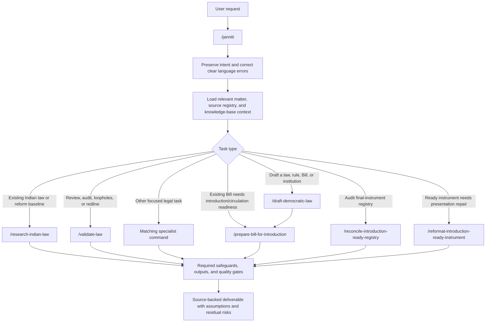

# Command Reference

Commands are portable Markdown workflows. Claude Code, OpenCode, and Antigravity have native adapters; other harnesses can use the same command name and its file in `commands/`. In Antigravity, open this repository as the workspace root and type `/` in the editor Agent chat.

| Command | Use it for | Main output |
|---|---|---|
| `/janniti <user request>` | **Primary entry point.** Correct and contextualise an imperfect request, then dispatch it to the right workflow. | Routing record, refined prompt, and invoked workflow output. |
| `/research-indian-law <topic>` | Research controlling Indian Union and State/UT law before drafting or reform. | Source-pinned Indian law landscape research pack. |
| `/refine-and-route <user request>` | Backward-compatible alias for `/janniti`. | Same as `/janniti`. |
| `/expert-legal-review <target>` | Independent review of law, policy, decision, or framework. | Issue register, redlines, accountability analysis, residual risks. |
| `/draft-democratic-law <objective>` | New statute, rule, Bill, amendment, or institution. | Drafting record; for every new Bill/formal instrument it automatically runs `/prepare-bill-for-introduction`. |
| `/prepare-bill-for-introduction <Bill>` | Automatic final stage for a new Bill/formal instrument; manually repair an existing generated Bill for Parliament introduction/circulation. | Clean Bill package, repair-and-filing record, redline, and a hard readiness/blocker statement. |
| `/reformat-introduction-ready-instrument <instrument>` | Fix presentation defects in an existing clean instrument without changing legal meaning. | Reformatted final file, formatting redline, and format-validator result. |
| `/reconcile-introduction-ready-registry` | Audit every final-instrument candidate and repair the registry. | Candidate/registry reconciliation report; valid missing instruments registered and failures blocked. |
| `/validate-law <target>` | Loophole and legal-risk validation. | Severity-ranked loophole-and-solution register. |
| `/legislative-lint <file>` | Mechanical and contextual drafting preflight. | Rule findings, exploitation path, exact correction. |
| `/build-legal-provenance <work>` | Claim-level research traceability. | Source-pinned ledger in `provenance/`. |
| `/verify-legal-citations <target>` | Check authority, pinpoint, status, version, and later history. | Claim/source table and reliance status. |
| `/constitutional-stress-test <target>` | Capture, emergency, discrimination, and remedy-failure testing. | Scenario matrix, single-point register, safeguards. |
| `/map-institutional-power <target>` | Appointment, funding, control, enforcement, and review mapping. | Power map, concentration findings, capture fixes. |
| `/monitor-democratic-impact <target>` | Post-enactment outcomes and accountability. | Indicators, audit, complaints, triggers, correction/repeal routes. |
| `/public-deliberation <target>` | Genuine and accessible anti-capture consultation. | Publication, participation, response-to-comments, remedies. |
| `/public-legal-accessibility <target>` | Plain-language and accessible public legal communication. | Language, format, accessibility, and comprehension plan. |
| `/expert-escalation <target>` | Independent review of high-risk legal work. | Review brief, reviewer criteria, conflicts, unresolved issues. |
| `/score-democratic-quality <target>` | Explainable democratic-design assessment. | Evidence-backed 0–5 scorecard with blocking failures. |
| `/monitor-legal-change <target>` | Authoritative source/version change. | Snapshot diff, status check, dependency revalidation plan. |

## Run examples

Use `/janniti` for new work; it selects the appropriate workflow automatically. The specialist commands below are also directly runnable when the task is already clear. Replace angle-bracketed text with the relevant file path, matter folder, link, or text.

| Command | Copy-ready example |
|---|---|
| `/janniti` | `/janniti draft a Union Bill to make public procurement decisions and contracts searchable, with rights-respecting appeal routes.` |
| `/refine-and-route` | `/refine-and-route pls chek this media bill for free speech loopholes: <Bill file>` |
| `/research-indian-law` | `/research-indian-law current Union and State/UT law on whistleblower protection in India` |
| `/draft-democratic-law` | `/draft-democratic-law Draft a Karnataka Bill for transparent municipal budgeting and participatory disclosure.` |
| `/prepare-bill-for-introduction` | `/prepare-bill-for-introduction outputs/001-municipal-budget-bill/01-draft/draft-bill.md` |
| `/reformat-introduction-ready-instrument` | `/reformat-introduction-ready-instrument outputs/001-municipal-budget-bill/01-draft/introduction-ready-municipal-budget-bill.md` |
| `/reconcile-introduction-ready-registry` | `/reconcile-introduction-ready-registry` |
| `/validate-law` | `/validate-law Review this proposed procurement Bill for constitutional, corruption, enforcement, and equality loopholes: <Bill file>` |
| `/expert-legal-review` | `/expert-legal-review Independently review this proposed media-regulation framework: <file or official link>` |
| `/legislative-lint` | `/legislative-lint outputs/001-municipal-budget-bill/01-draft/introduction-ready-municipal-budget-bill.md` |
| `/build-legal-provenance` | `/build-legal-provenance outputs/001-municipal-budget-bill/01-draft/analysis-and-drafting-record.md` |
| `/verify-legal-citations` | `/verify-legal-citations Check the current status and support for every citation in: <draft or memorandum>` |
| `/constitutional-stress-test` | `/constitutional-stress-test Stress-test this emergency public-health Bill against capture, selective enforcement, and excessive restrictions: <Bill>` |
| `/map-institutional-power` | `/map-institutional-power Map appointment, funding, direction, enforcement, and review power in this anti-corruption authority Bill: <Bill>` |
| `/monitor-democratic-impact` | `/monitor-democratic-impact Design a public impact monitor for this education-rights Bill: <Bill>` |
| `/public-deliberation` | `/public-deliberation Create an accessible consultation plan for this housing Bill: <Bill>` |
| `/public-legal-accessibility` | `/public-legal-accessibility Produce a plain-English, Hindi, low-data, and screen-reader-friendly public explanation of this tenancy Bill: <Bill>` |
| `/expert-escalation` | `/expert-escalation Prepare the independent-review brief for this election-finance Bill: <Bill>` |
| `/score-democratic-quality` | `/score-democratic-quality Score this surveillance proposal for rights, equality, accountability, and capture safeguards: <proposal>` |
| `/monitor-legal-change` | `/monitor-legal-change Compare the earlier and amended Gazette text of this rule and identify affected outputs: <old text> <new text>` |

## Request routing



For Indian drafting, validation, or reform work, `/janniti` invokes `/research-indian-law` before the primary workflow where required by the charter. High-risk work also invokes `/expert-escalation`.

`/prepare-bill-for-introduction` runs automatically after every new Bill or formal legislative instrument is drafted. It is also the repair route for a Bill that already exists. It is not a label-only conversion: it revises the operative text, creates a redline and filing record, completes only applicable ancillary memoranda, and refuses an introduction-ready label while formal or legal blockers remain. A successful gate automatically adds a direct link to the final file in [the introduction-ready instrument registry](../outputs/introduction-ready-registry.md).

## Reconciling the introduction-ready registry

Run `/reconcile-introduction-ready-registry` when you want an auditable sweep of all final-instrument candidates. It scans every matter by default, identifies candidate files not represented in the registry, validates each candidate before registration, and finds registry entries whose final file no longer exists.

```text
/reconcile-introduction-ready-registry
```

To target one matter, include its folder in the request:

```text
/reconcile-introduction-ready-registry outputs/001-municipal-budget-bill
```

Expected outcomes are:

| Finding | Action |
|---|---|
| Unregistered candidate passes the full gate | Add its clean final-file link to the registry. |
| Unregistered candidate has legal/formal defects | Keep it out of the registry and record exact blockers. |
| Registry entry has no corresponding final file | Correct the record or preserve a documented historical explanation. |
| No discrepancies | Confirm the generated registry and audit are current. |

The command must not register a file solely because its name begins `introduction-ready-`. Registry inclusion means JanNiti's documented readiness gate passed; it never means that Parliament has introduced, accepted, certified, or enacted the instrument.

Successful registration and reconciliation regenerate both [the registry](../outputs/introduction-ready-registry.md) and the README's **Registered introduction-ready instruments** section. The final Bill formatter also requires each enumerated legal item to appear on its own rendered line with correct nesting; Markdown bullets and code-block indentation are not allowed in the clean Bill.

## Inputs

Give the jurisdiction, date or as-of date, relevant legal level, and target document or objective whenever known. If material information is unavailable, JanNiti must state the assumption and limitation rather than inventing it.

Before new substantive work, create one numbered matter folder with `python3 scripts/new_output.py "<title>"`; reuse it for later work on the same matter. Save each generated artefact in its matching subfolder. The command mapping is in [the matter register](../outputs/README.md).

## Quality requirements

All consequential commands use primary sources first; distinguish current law, verified fact, interpretation, policy option, and draft text; show adverse authority and uncertainty; protect rights and equal treatment; and keep recommendations non-partisan. High-risk work requires `/expert-escalation`.

## Mechanical helpers

- `python3 scripts/verify_legal_citations.py --strict <file.md>`
- `python3 scripts/lint_legislation.py <file>`
- `python3 scripts/validate_claim_provenance.py <ledger.json>`
- `python3 scripts/analyze_power_map.py <map.json>`
- `python3 scripts/validate_democratic_monitor.py <plan.json>`
- `python3 scripts/validate_public_deliberation.py <plan.json>`
- `python3 scripts/validate_democratic_scorecard.py <scorecard.json>`
- `python3 scripts/diff_legal_versions.py <old> <new>`
- `python3 scripts/validate_legal_change_event.py <event.json>`
- `python3 scripts/validate_indian_law_research.py <research-pack.md>`
- `python3 scripts/validate_indian_law_research_manifest.py <research-manifest.json>`
- `python3 scripts/validate_state_ut_source_registry.py`
- `python3 scripts/build_matter_index.py --check`
- `python3 scripts/redline_legal_text.py <old> <new> --output <redline.md>`
- `python3 scripts/validate_independent_review.py <register.json>`
- `python3 scripts/validate_introduction_ready_format.py <introduction-ready-bill.md>`
