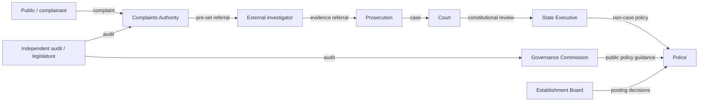

# Institutional Power Review — Proposed Police Package

## Power map

The mechanical map detects no actor holding three or more of the listed critical levers over the same target and no reciprocal control loop. That is a structural preflight only, not proof against real-world capture.

## Concentration and dependency register

| Actor / dependency | Risk | Safeguard required before draft |
|---|---|---|
| State executive | May use budget, informal transfers, personnel and secrecy to negate non-interference rules. | Statutory written-direction rule, published aggregate transfer data, reasoned exceptions, plural appointment process, independent audit and court remedy. |
| Governance Commission | Could become a proxy political board or policy veto. | No case role; staggered plural membership, conflicts/recusal, fixed public reporting, limited policy remit, judicial review. |
| Complaints Authority | Could become an unaccountable super-police body or a complaint bottleneck. | Intake/preservation/referral/review only; no prosecution/adjudication; filing deadlines, reasons, appeal and public aggregate data. |
| External investigator | Could be captured by the originating police hierarchy. | Allocation rules fixed before cases, conflict screening, evidence-preservation obligation, prosecutor/court oversight and reassignment remedy. |
| Evidence system contractor | Could control camera access, retention or deletion. | Procurement separation, encryption/access logs, independent audit, vendor non-direction clause, retention/deletion policy and sanctions for tampering. |

## Capture simulation and exact fixes

| Scenario | Abuse path | Rating before safeguard | Exact structural fix |
|---|---|---:|---|
| Hostile State majority targets a critic | Informal order → selective arrest → evidence loss → complaint delay. | Critical | Case-specific direction ban; objective opening threshold; independent record preservation; assigned investigator; prosecutor reasons; prompt court access; comparator audit. |
| Captured police hierarchy protects its own | Complaint is sent back to same chain of command. | High | Automatic pre-set external referral for death, serious injury, sexual violence, credible torture, disappearance and retaliatory-policing allegations; conflict challenge. |
| Corrupt complaints authority suppresses files | Intake is not acknowledged or is marked closed without reasons. | High | Time-stamped receipt, complainant access, public aggregate closure data, appeal to court/independent review and tamper-evident audit trail. |
| Technology vendor or police deletes footage | Access credentials and retention are controlled by the investigated unit. | High | Segregated evidence custodian, immutable event logs, prompt preservation notice, independent audit and court-supervised remedy; no blanket reverse criminal burden. |
| Emergency used to defeat the framework | Executive labels normal crowd control or political protest an emergency. | High | Narrow definition, written reasons, short expiry, legislative notice, court review, no suspension of anti-torture, recording, counsel, medical or complaint safeguards. |

## Residual risk

Law cannot by itself prevent covert political pressure, falsified records, resource starvation or retaliatory culture. The framework must therefore be accompanied by transparent budgets, open aggregate data, protected press and civil-society scrutiny, legal aid, independent audits, enforceable court remedies and periodic legislative review.
